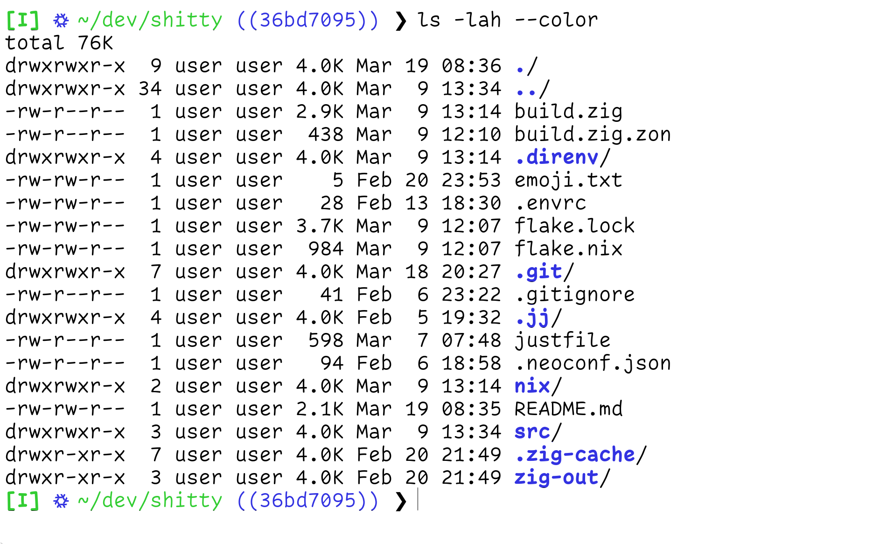
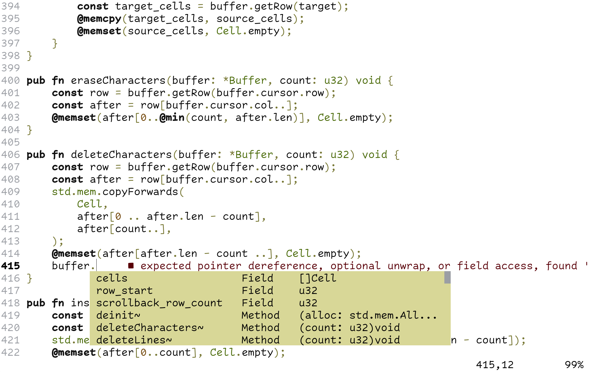

# `shitty` - Low-latency Terminal Emulator

> The name `shitty` will be change to something less awful when more
> feature-complete and a bit less... shitty.

## Building

Using `zig 0.14.0`, and assuming you have the required system libraries
(otherwise, see below):

```
zig build -Doptimize=ReleaseSafe
```

This will produce an executable `zig-out/bin/shitty`.


### Dependencies

We manage dependencies using a Nix `devShell`:

1. Install Nix by either:
    - From [homepage](https://nixos.org/download/)
    - Using the [Determinate Installer](https://github.com/DeterminateSystems/nix-installer)
    - Using your package manager (`apt install nix-bin`, etc.)

2. Activate the shell by either:
    - `nix develop`
    - `direnv allow` (requires `direnv` or `nix-direnv`)
    - Using the `Nix` plugin for Visual Studio Code.


## Why another terminal emulator?

There are many modern terminal emulators out there to pick from today
(alacritty, ghostty, kitty, WezTerm, etc.), and they all have one headline
feature "GPU acceleration".

While GPUs are great when it comes to raw throughput, it seems none can match
the very low input latency (and consistency) of legacy terminal emulators such
as XTerm and mlterm, which do all their rendering on the CPU
([source](https://beuke.org/terminal-latency/)). In my personal experience,
latency is much more important for interactive applications than throughput: we
care more about the "feel" and how snappy something is, than how fast you can
`cat` a large file.

Furthermore, relying on the GPU for drawing operations means the terminal is
brought to a crawl when the GPU is fully utilized by another demanding
application (such as during game-dev and machine learning).

`shitty` is an experimental terminal emulator which attempts to combine the
performance of the legacy CPU rasterized terminals with the features expected
by a modern temrinal emulator, fixing some of the warts with XTerm.


## Features

- [x] CPU rasterized (X11)
- [x] Reflow lines on resize
- [x] Unlimited font sizes (XTerm is limited to 8)
- [ ] Damage detection: reuse unchanged regions from last frame
- [ ] Clickable links/paths (`http://`, `src/my/file.zig`, etc.)
- [ ] Hot-reload config file


### Escape Sequences

There are hundreds of different escape sequences different terminal emulators
expose. In practice however, only a small subset of those are actually used by
any given application. In `shitty` so far, we have taken an incremental
approach to implementing these escape sequence and only implement the escape
sequences needed to run the programs we use daily. Thus, by only implementing a
few dozen escape sequences, we have been able to run advanced applications
such as `neovim`, `fish` and `bash` with no significant issues.


## Gallery

> `shitty` running with the output of `ls` in the `fish` shell, with colors,
> bold text, and a nerd-font (nix logo):



> `shitty` running `neovim`:


